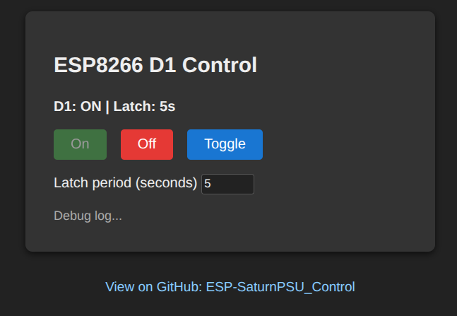

# ESP8266 D1 HTTP Control

This project runs on an ESP8266 NodeMCU (ESP-12E, CP2102) and exposes a web page plus a REST API to control the D1 pin (GPIO5).

## Requirements
- PlatformIO (recommended)
- ESP8266 NodeMCU (ESP-12E)
- Python 3.8+ with pip

## Install PlatformIO CLI (Linux)

### Option A: pipx (isolated install, recommended)
1) Install pipx

```bash
python3 -m pip install --user pipx
```

2) Ensure your shell can find pipx

```bash
python3 -m pipx ensurepath
```

3) Install PlatformIO

```bash
pipx install platformio
```

4) Open a new terminal and verify

```bash
pio --version
```

### Option B: pip (user install)
If you prefer not to use pipx:

```bash
python3 -m pip install --user platformio
```

Then verify:

```bash
pio --version
```

### Option C: system packages
Some distros ship a PlatformIO package (may be older). If you use it, ensure `pio --version` shows a recent release.

## USB serial permissions (Linux)
If upload or monitor fails with permission errors, add your user to the serial group and re-login:

```bash
sudo usermod -a -G dialout "$USER"
```

After logging out and back in, confirm access:

```bash
groups
```

Typical device nodes for CP2102 are `/dev/ttyUSB0` or `/dev/ttyUSB1`.

## Regenerate venv and build tools
This project includes a small bootstrap script and `requirements.txt` to recreate the local Python virtual environment and prefetch PlatformIO build tools.

Files:
- `requirements.txt`: Python dependencies for the local venv (includes PlatformIO CLI)
- `scripts/bootstrap.sh`: Creates `.venv`, installs dependencies, and downloads PlatformIO packages

Clean start (optional):

```bash
rm -rf .venv .pio
```

If you also want to wipe globally cached PlatformIO packages (not required):

```bash
rm -rf ~/.platformio
```

Run the bootstrap script:

```bash
chmod +x scripts/bootstrap.sh
./scripts/bootstrap.sh
```

After bootstrap, build as usual:

```bash
./.venv/bin/pio run
```

## WiFi configuration
WiFi credentials are loaded from an unencrypted JSON file on LittleFS.

1. Copy data/wifi_replace_me.json to data/wifi.json
2. Edit data/wifi.json with your credentials
3. Upload the filesystem (see below)

### JSON schema
- `ssid` (string, required): WiFi network name
- `password` (string, required): WiFi password (can be empty for open networks)
- `hostname` (string, optional): Device hostname shown by the router
- `connect_timeout_ms` (number, optional): Max time to wait for WiFi connect; default is 20000
- `notes` (array of strings, optional): Any extra notes; ignored by firmware

Example (wifi_replace_me.json):

```json
{
	"ssid": "your-ssid",
	"password": "your-password",
	"hostname": "esp8266-d1",
	"connect_timeout_ms": 20000,
	"notes": [
		"Replace ssid/password with your network",
		"Extra fields are ignored by the firmware"
	]
}
```

Upload the filesystem before flashing the firmware:

```bash
pio run -t uploadfs
```

## Build and upload

```bash
pio run -t upload
```

Open serial monitor at 74880 to see the device IP and boot logs:

```bash
pio device monitor -b 74880
```
If you are using VS Code tasks, run:
- PlatformIO: Monitor

## Web UI Features

Visit the device IP in a browser to open the control page. The web UI provides:

- **ON/OFF/TOGGLE Buttons:** Instantly control the D1 pin state. Button color reflects the current state (green for ON, orange for OFF).
- **Latch Period Input:** Set a latch period (in seconds) to automatically revert the D1 state after toggling. Enter a value and use ON/OFF/TOGGLE as usual.
- **Status Display:** Shows the current D1 state and updates in real time.
- **Debug Log:** A scrollable area below the controls displays timestamped debug messages, including actions, errors, and API failures. The log auto-scrolls as new messages arrive.
- **Refresh Button:** Manually refreshes the D1 state and status from the device.

### Example UI


*Main control panel with ON/OFF/TOGGLE, latch input, and debug log.*

> **Tip:** If you see 'Status: ERROR' or debug messages about API failures, check your device connection and network.

## REST API

### REST API Endpoints

| Method | Path           | Description                                                      | Example Response           |
|--------|----------------|------------------------------------------------------------------|----------------------------|
| GET    | /              | Web UI (HTML page)                                               | (HTML)                     |
| GET    | /api/status    | Get current D1 state and latch info                              | `{ "d1": 1, "latch": 0 }` |
| POST   | /api/on        | Set D1 HIGH (ON), starts latch timer if set                      | `{ "d1": 1 }`              |
| POST   | /api/off       | Set D1 LOW (OFF), starts latch timer if set                      | `{ "d1": 0 }`              |
| POST   | /api/toggle    | Toggle D1 state, starts latch timer if set                       | `{ "d1": 0 }` or `{ "d1": 1 }` |
| GET    | /api/latch     | Get current latch period (seconds)                               | `{ "latch": 5 }`           |
| POST   | /api/latch     | Set latch period (seconds, 0 disables latch; see SRS for min/max) | `{ "latch": 10 }`          |
| GET    | /menu          | Plain-text status menu (for legacy/CLI use)                      | (text)                     |
| POST   | /api/v1/reset     | Clear latch, set D1 LOW (test setup/reset)                       | `{ "reset": true }`         |

#### Details

- **/api/on, /api/off, /api/toggle**: All return the new D1 state as JSON. If latch is active, state changes may be rejected with `{ "error": "Latch active" }` and HTTP 423.
- **/api/latch**: GET returns current latch period; POST sets a new period (0 disables latch). Returns new value as JSON.
- **/api/v1/reset**: For test setup. Immediately disables latch and sets D1 LOW. Always returns `{ "reset": true }`.
- **/api/status**: Returns current D1 state and latch timer (if active).
- **/menu**: Returns a plain-text status summary for CLI/legacy use.

##### Example: /api/status
```json
{"d1":1, "latch":0}
```

##### Example: /api/latch (POST)
Request:
```json
{"latch": 10}
```
Response:
```json
{"latch": 10}
```
*Note: Latch period must be between 1 and 3600 seconds. 0 disables latch. See SRS for details.*

##### Example: /api/v1/reset
Request:
```bash
curl -X POST http://<device-ip>/api/v1/reset
```
Response:
```json
{"reset":true}
```


## Automated Testing

This project includes automated test suites for the REST API and device behavior:

- **Robot Framework API tests** (recommended, runs in Docker):
	- Location: `scripts/test_api.robot`
	- Run with Docker:
		```bash
		docker build -t esp8266-robot-tests .
		docker run --rm -e DEVICE_IP=192.168.1.107 esp8266-robot-tests
		```
		(Replace the IP as needed.)
	- See `scripts/robot_test_README.md` for details.

- **Python API test script** (optional):
	- Location: `scripts/test_api.py`
	- Run with:
		```bash
		python3 scripts/test_api.py 192.168.1.107
		```

Test results are shown in the terminal. The Robot Framework suite covers all REST API endpoints and basic device logic.

## Test Campaign

See `docs/test-campaign.md` for a full manual and automated test checklist covering firmware, API, web UI, deployment, and documentation.

## Notes
- D1 corresponds to GPIO5.
- The control output is active HIGH by default.
