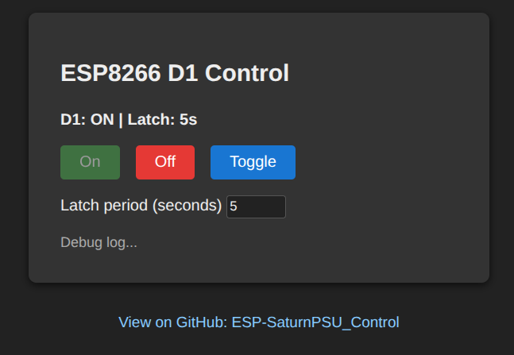
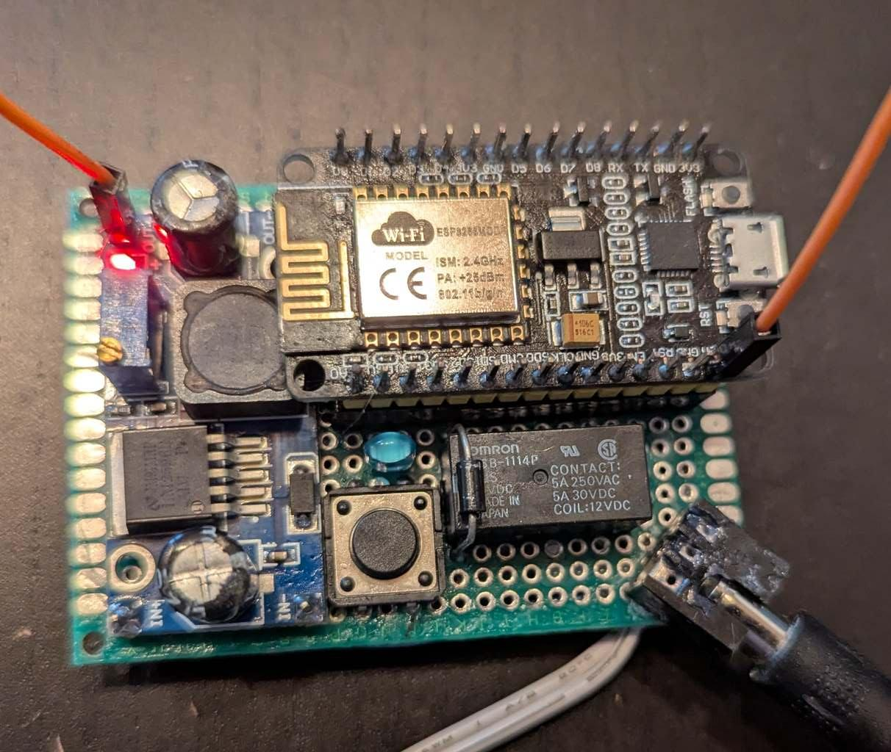
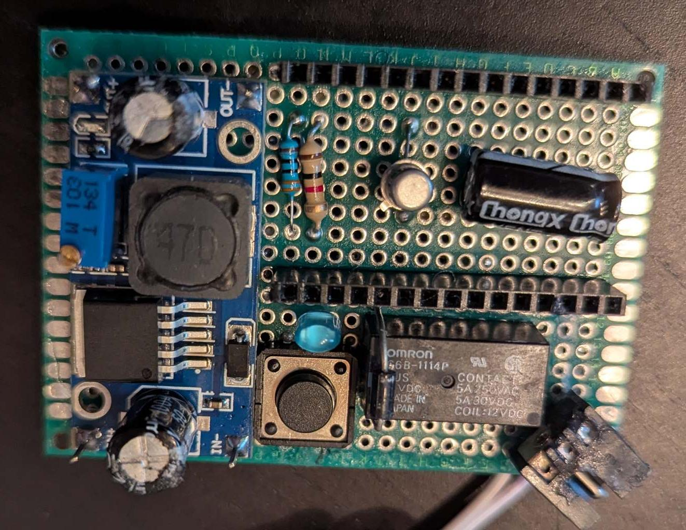

# ESP8266 D1 HTTP Control

[YouTube Demo: ESP8266 D1 Control Device](https://www.youtube.com/watch?v=zFmUQA3u5PM)

This project runs on an ESP8266 NodeMCU (ESP-12E, CP2102) and exposes a web page plus a REST API to control the D1 pin (GPIO5).

**Vibe coded project for learning purpose only.**

## Hardware Features
- **D1 (GPIO5):** Relay control output (active HIGH)
- **D2 (GPIO4):** Physical NO push button for manual D1 toggle (debounced, respects latch period)
- **Optional:** 10kΩ pull-up resistor for D2 (use only if internal pull-up is insufficient)
- **Relay:** Omron G6B-1114P-US or compatible
- **See:** `hw/BOM_ESP8266_Relay_Control.txt` for full parts list

## Requirements
- PlatformIO (recommended)
- ESP8266 NodeMCU (ESP-12E)
- Python 3.8+ with pip

## Install PlatformIO CLI (Linux)

### Option A: pipx (isolated install, recommended)
1) Install pipx

```bash
python3 -m pip install --user pipx
```

2) Ensure your shell can find pipx

```bash
python3 -m pipx ensurepath
```

3) Install PlatformIO

```bash
pipx install platformio
```

4) Open a new terminal and verify

```bash
pio --version
```

### Option B: pip (user install)
If you prefer not to use pipx:

```bash
python3 -m pip install --user platformio
```

Then verify:

```bash
pio --version
```

### Option C: system packages
Some distros ship a PlatformIO package (may be older). If you use it, ensure `pio --version` shows a recent release.

## USB serial permissions (Linux)
If upload or monitor fails with permission errors, add your user to the serial group and re-login:

```bash
sudo usermod -a -G dialout "$USER"
```

After logging out and back in, confirm access:

```bash
groups
```

Typical device nodes for CP2102 are `/dev/ttyUSB0` or `/dev/ttyUSB1`.

## Regenerate venv and build tools
This project includes a small bootstrap script and `requirements.txt` to recreate the local Python virtual environment and prefetch PlatformIO build tools.

Files:
- `requirements.txt`: Python dependencies for the local venv (includes PlatformIO CLI)
- `scripts/bootstrap.sh`: Creates `.venv`, installs dependencies, and downloads PlatformIO packages

Clean start (optional):

```bash
rm -rf .venv .pio
```

If you also want to wipe globally cached PlatformIO packages (not required):

```bash
rm -rf ~/.platformio
```

Run the bootstrap script:

```bash
chmod +x scripts/bootstrap.sh
./scripts/bootstrap.sh
```

After bootstrap, build as usual:

```bash
./.venv/bin/pio run
```

## WiFi configuration
WiFi credentials are loaded from an unencrypted JSON file on LittleFS.

1. Copy data/wifi_replace_me.json to data/wifi.json
2. Edit data/wifi.json with your credentials
3. Upload the filesystem (see below)

### JSON schema
- `ssid` (string, required): WiFi network name
- `password` (string, required): WiFi password (can be empty for open networks)
- `hostname` (string, optional): Device hostname shown by the router
- `connect_timeout_ms` (number, optional): Max time to wait for WiFi connect; default is 20000
- `notes` (array of strings, optional): Any extra notes; ignored by firmware

Example (wifi_replace_me.json):

```json
{
	"ssid": "your-ssid",
	"password": "your-password",
	"hostname": "esp8266-d1",
	"connect_timeout_ms": 20000,
	"notes": [
		"Replace ssid/password with your network",
		"Extra fields are ignored by the firmware"
	]
}
```

Upload the filesystem before flashing the firmware:

```bash
pio run -t uploadfs
```

## Build and upload

```bash
pio run -t upload
```

Open serial monitor at 74880 to see the device IP and boot logs:

```bash
pio device monitor -b 74880
```
If you are using VS Code tasks, run:
- PlatformIO: Monitor


## Web UI Features

Visit the device IP in a browser to open the control page. The web UI provides:

- **ON/OFF/TOGGLE Buttons:** Instantly control the D1 pin state. Button color reflects the current state (green for ON, red for OFF). Buttons are disabled while the latch is active or if the action is not allowed.
- **Latch Period Input:** Set the latch period (in seconds) to prevent rapid toggling. The input is for user entry only and is not auto-refreshed from device status. Allowed range: 1–3600 seconds.
- **Status Display:** Shows the current D1 state and latch period, updates in real time (every 200ms).
- **Debug Log:** Scrollable area below the controls displays recent debug messages, actions, and API errors. Auto-scrolls as new messages arrive.
- **No Refresh Button:** The UI auto-updates status and disables the Refresh button (removed in latest version).

### Example UI


*Main control panel with ON/OFF/TOGGLE, latch input, and debug log.*

> **Tip:** If you see 'Status: ERROR' or debug messages about API failures, check your device connection and network.


## Physical Push Button (D2)

- **D2 (GPIO4):** Connect a normally open (NO) push button between D2 and GND.
- **Behavior:** Pressing the button toggles D1, subject to the latch period (cannot toggle if latch is active). Input is debounced in firmware.
- **Optional:** Add a 10kΩ pull-up resistor if needed (firmware uses INPUT_PULLUP).

## REST API

### REST API Endpoints

| Method | Path           | Description                                                      | Example Response           |
|--------|----------------|------------------------------------------------------------------|----------------------------|
| GET    | /              | Web UI (HTML page)                                               | (HTML)                     |
| GET    | /api/v1/status    | Get current relay status and latch info                          | `{ "relay_status": "ON", "latch": 0 }` |
| POST   | /api/v1/on        | Set D1 HIGH (ON), starts latch timer if set                      | `{ "relay_status": "ON" }`              |
| POST   | /api/v1/off       | Set D1 LOW (OFF), starts latch timer if set                      | `{ "relay_status": "OFF" }`              |
| POST   | /api/v1/toggle    | Toggle D1 state, starts latch timer if set                       | `{ "relay_status": "ON" }` or `{ "relay_status": "OFF" }` |
| GET    | /api/v1/latch     | Get current latch period (seconds)                               | `{ "latch": 5 }`           |
| POST   | /api/v1/latch     | Set latch period (seconds, 0 disables latch; see SRS for min/max) | `{ "latch": 10 }`          |
| GET    | /menu          | Plain-text status menu (for legacy/CLI use)                      | (text)                     |
| POST   | /api/v1/reset     | Clear latch, set D1 LOW (test setup/reset)                       | `{ "reset": true }`         |


#### Details

- **/api/v1/on, /api/v1/off, /api/v1/toggle:** All return the new D1 state as JSON. If the latch is active, state changes are rejected with `{ "error": "Latch active" }` and HTTP 423.
- **/api/v1/latch:** GET returns current latch period; POST sets a new period (range: 1–3600 seconds). Returns new value as JSON. Setting to 0 disables the latch.
- **/api/v1/reset:** For test setup. Immediately disables latch and sets D1 LOW. Always returns `{ "reset": true }`.
- **/api/v1/status:** Returns current D1 state and latch timer (if active).
- **/menu:** Returns a plain-text status summary for CLI/legacy use.

##### Example: /api/v1/status
```json
{"relay_status":"ON", "latch":0}
```

##### Example: /api/v1/latch (POST)
Request:
```json
{"latch": 10}
```
Response:
```json
{"latch": 10}
```
*Note: Latch period must be between 1 and 3600 seconds. 0 disables latch. See SRS for details.*

##### Example: /api/v1/reset
Request:
```bash
curl -X POST http://<device-ip>/api/v1/reset
```
Response:
```json
{"reset":true}
```

## Automated Testing

This project includes automated and manual test suites for firmware, REST API, web UI, and hardware features:

- **Robot Framework API tests** (recommended, runs in Docker):
	- Location: `scripts/test_api.robot`
	- Run with Docker:
		```bash
		docker build -t esp8266-robot-tests .
		docker run --rm -e DEVICE_IP=192.168.1.107 esp8266-robot-tests
		```
		(Replace the IP as needed.)
	- See `scripts/robot_test_README.md` for details.

- **Python API test script** (optional):
	- Location: `scripts/test_api.py`
	- Run with:
		```bash
		python3 scripts/test_api.py 192.168.1.107
		```

- **Manual Hardware/UI Tests:**
	- See `docs/test-campaign.md` for a full checklist, including:
		- D2 push button toggles D1, respects latch period, and is debounced
		- UI disables ON/OFF/TOGGLE during latch
		- Latch input is input-only (not auto-refreshed)
		- No Refresh button (UI auto-updates)
		- All REST API and UI features

Test results are shown in the terminal or browser. The Robot Framework suite covers all REST API endpoints and device logic.


## Test Campaign

See `docs/test-campaign.md` for a full manual and automated test checklist covering:
- Firmware and REST API
- Web UI (including D2 push button and latch logic)
- Hardware wiring and deployment
- Documentation completeness


## Hardware Images

### Device Front View 1


### Device Front View 2



## Notes
- D1 corresponds to GPIO5 (relay control output)
- D2 corresponds to GPIO4 (NO push button input)
- The control output is active HIGH by default
- Latch period prevents rapid toggling; minimum 1s, maximum 3600s
- D2 input is debounced and respects latch lockout
- UI disables ON/OFF/TOGGLE during latch; latch input is not auto-refreshed
- See SRS and test campaign for full requirements